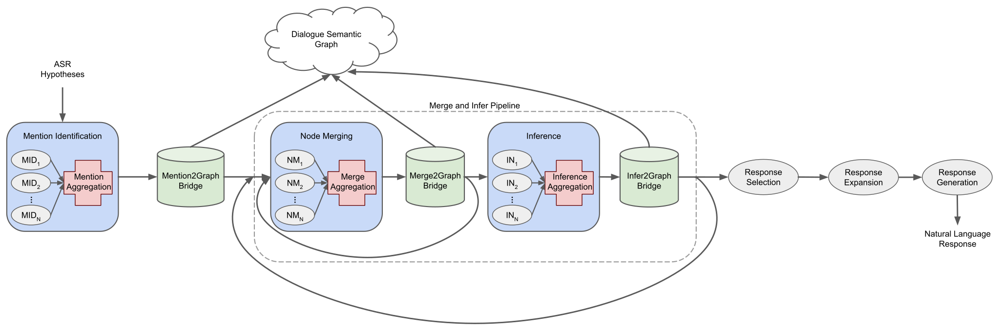

# GRIDD Framework

The Graph Reasoning for Inference Driven Dialogue (GRIDD) Framework provides an API 
for building dialogue management pipelines that use a Dialogue Semantic Graph (DSG) for 
utterance understanding and decision-making.

The general dialogue management pipeline available within the Framework 
is shown in Figure 1 (above).  

### Components

The GRIDD pipeline is built from the combination of 6 element types.

#### Module

<image src="doc/img/module.png" width="150"/>

The basic element of GRIDD is a `Module`. 
A `Module` is the low-level implementation of a model. 

Every `Module` contains a `run(input, graph)` function which is the calling process
of that `Module` in the pipeline. 
The `input` parameter is `Module`-specific but the `graph` parameter is always the 
current `DSG` being operated on by the pipeline. 
Modules should never directly modify the `graph` input (see Bridge).
The output of `run` is also `Module`-specific.

There are 6 types of `Modules` used in GRIDD which correspond to the 6 tasks 
that compose the dialogue management process:

* Mention Identification

  `:param input` -

  `:return output` - 

* Node Merging

  `:param input` -

  `:return output` - 

* Inference

  `:param input` -

  `:return output` - 

* Response Selection

  `:param input` -

  `:return output` - 

* Response Expansion

  `:param input` -

  `:return output` - 

* Response Generation

  `:param input` -

  `:return output` - 

GRIDD contains default `Modules` for these 6 tasks. 
For more sophisticated processing, new models can be incorporated into the pipeline
by implementing classes that inherit from the appropriate base `Module` and adding 
them to their respective pipeline element (see Pipeline and Branch).

#### Bridge

<image src="doc/img/bridge.svg" width="150"/>

A `Bridge` element enables interactions with the `DSG`. 
`Bridges` are used after the stages which output features that impact the current DSG:
`Mention Identification`, `Node Merging`, and `Inference`. 
All `DSG` updates are conducted within a `Bridge` element.

Every `Bridge` contains a `run(input, graph)` function which is the calling process
of that `Bridge` in the pipeline. 
The `input` parameter is `Bridge`-specific but the `graph` parameter is always the 
current `DSG` being operated on by the pipeline. 
The output of `run` is a binary value indicating where the `DSG` was successfully 
updated. (TODO - verify)

#### Branch

<image src="doc/img/branchaggreg.svg" width="150"/>

A `Branch` specifies a parallel execution of framework elements. 
These elements can be of type `Module`, `Branch`, `Aggregator`, or `Pipeline`.
Each element receives the same original input and outputs their own 
resultant feature specification. All outputs are accumulated into a
dictionary structure, with `key` equal to the name of the element and `value` 
equal to that element's output.

Every `Branch` contains a `run(input, graph)` function which is the calling process
of that `Branch` in the pipeline. 
The `input` parameter is `Branch`-specific but the `graph` parameter is always the 
current `DSG` being operated on by the pipeline. 
The output of `run` is also `Branch`-specific, although it will always be a dictionary 
on the outermost level.

#### Aggregator

<image src="doc/img/branchaggreg.svg" width="150"/>

An `Aggregator` element combines multiple outputs into a single consolidated output. 
It is used in combination with `Branch` elements in order to create a 
Mixture-of-Experts model formulation where desired. 
It is initialized with a link to the `Branch` that is corresponds to. This way
it has access to all meta-information associated with the `Modules` that the 
`Branch` contains which is helpful for ensuring flexible aggregation procedures.

Every `Aggregator` contains a `run(input, graph)` function which is the calling process
of that `Aggregator` in the pipeline. 
The `input` parameter is `Aggregator`-specific but it will always be a dictionary 
on the outermost level. The `graph` parameter is always the 
current `DSG` being operated on by the pipeline. 
The output of `run` is `Aggregator`-specific but it will always be the 
consolidated version of the input.

#### Pipeline

<image src="doc/img/pipeline.svg" width="150"/>

A `Pipeline` specifies an ordered execution of framework elements.
These elements can be of type `Module`, `Branch`, `Aggregator`, or `Pipeline`.
Each subsequent element receives as input the output of the previous element.

Every `Pipeline` contains a `run(input, graph)` function which is the calling process
of that `Pipeline` in the pipeline. 
The `input` parameter is `Pipeline`-specific but the `graph` parameter is always the 
current `DSG` being operated on by the pipeline. 
The output of `run` is also `Pipeline`-specific.

#### Iteration

`Iteration functions` can be assigned to elements in the Framework. 
These `iteration functions` specify the conditions under which the element will re-execute, 
taking its output as the input of its next iteration. 
Once the stop condition is met, the next element in the framework will execute. 
`Iteration` is essentially a self-loop on elements.

