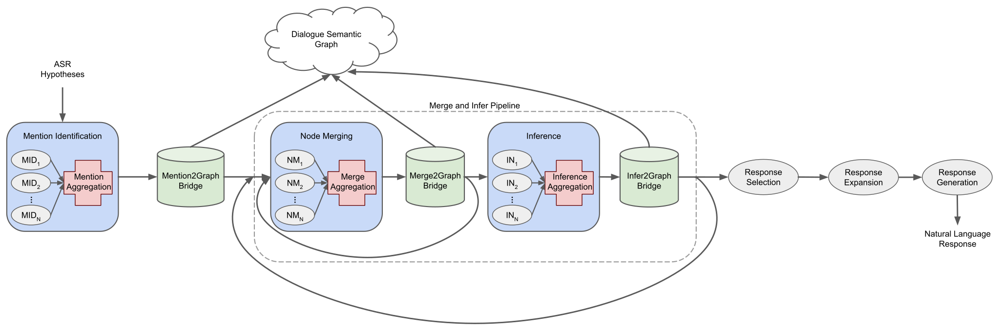

# GRIDD Framework

The Graph Reasoning for Inference Driven Dialogue (GRIDD) Framework provides an API 
for building dialogue management pipelines that use a Dialogue Semantic Graph (DSG) for 
utterance understanding and decision-making.

The general dialogue management pipeline available within the Framework 
is shown in Figure 1 (above).  

## Setup

(0) Required `Python >= 3.7`

(1) Install required dependencies:

* (a) Follow installation instructions at [pyswip](https://github.com/yuce/pyswip/blob/master/INSTALL.md) 
to install the latest stable version of SWI-Prolog.

    * Note: For MacOS, you must update your `PATH` and `DYLD_FALLBACK_LIBRARY_PATH` 
    environment variables to contain the SWI-Prolog file locations when executing `chatbot.py`. 
    The pyswip installation instructions provide example updated variables, however they 
    may not be correct for your computer. 
    To determine your `PATH` update, find where the `SWI-Prolog` executable file is located.
    To determine your `DYLD_FALLBACK_LIBRARY_PATH` update, find where the `libswipl.dylib` file is located.
    For our development machine, the appropriate locations were the following:

        PATH += `/Applications/SWI-Prolog.app/Contents/MacOS`

        DYLD_FALLBACK_LIBRARY_PATH = `/Applications/SWI-Prolog.app/Contents/Frameworks`

* (b) Execute `pip install -r GRIDD/requirements.txt`

(2) Clone the [structpy repository](https://github.com/jdfinch/structpy) into the parent directory 
of your cloned GRIDD directory.

(3) Download required files:

* [SentenceCasing data](https://github.com/nreimers/truecaser/releases/download/v1.0/english_distributions.obj.zip)
into the `GRIDD/resources` directory.

(4) Install the ELIT package and execute `elit serve` in a terminal. 
`elit serve` will run in the background.

