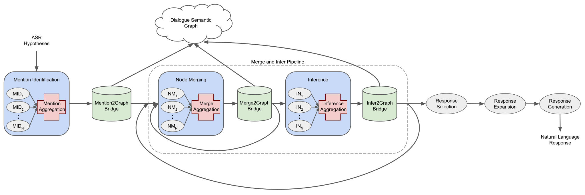

# GRIDD Framework

The Graph Reasoning for Inference Driven Dialogue (GRIDD) Framework provides an API 
for building dialogue management pipelines that use a Dialogue Semantic Graph (DSG) for 
utterance understanding and decision-making.

## 1. Mention Identification

Identify *concepts* in natural language.

**Input:** A list of automatic speech recognition (ASR) hypotheses, where each hypothesis
is a list of tokens. Each token has a confidence score between 0 and 1.

**Output:** A list of *mentions* and a list of *ambiguities*. Each *mention* is 
a (*concept graph*, *token span*) pair representing a natural language span from the input
and its formal semantic representation. Each *ambiguity* is a pair of mentions that represent
mutually exclusive interpretations of their respective spans.

The mention identification stage can consist of several models, each of which independently
finds *ambiguous mentions* from the natural langugage input. A **Mention Aggregation** step
combines the results of each model by concatenating each list of *mentions* and then adding
to the list of *ambiguities* every pair of *mentions* with overlapping spans.

### a. Dependency Parse to Logic Model

Uses a dependency parser and a set of custom dependency-parse-to-concept-graph translation
rules to find mentions. Especially useful for identifying predicate mentions where argument
structures are expressed by specific syntax.

### b. Named Entity Recognition Model (*_planned_)

Uses a NER tagging model to identify named entity mentions.

## 2. Mention to Graph Bridge

This stage simply adds all *mentions* identified in the previous stage to *working memory*. 
Ambiguous mentions are added with special *xor* links, which will be recognized by the **Inference to Graph
Bridge** stage when confidence scores are updated to simulate mutually exclusive semantic interpretations.

**Input:** A concept graph representing *working memory*, and a list of *mentions* and a list of 
*ambiguities* returned from the **Mention Identification** stage.

**Output:** An updated *working memory* concept graph.

## 3. Concept Merging

Identify equivalent *concepts* to merge in *working memory*. 

**Input:** a *concept graph* representing *working memory* (includes natural language originating from 
the ASR model)

**Output:** a list of (*concept*, *concept*, *score*) triples representing two concepts in 
*working memory* to merge and some confidence score for the merge decision.

Like **Mention Identification**, the concept merging stage contains a variable number of models
that independently generate concept merge pairs, each with a confidence score. A **Merge Aggregation**
step then combines these results by concatenating the merge pair lists. Merge pair entries with the 
same node pair are condensed to a single entry where the score is a sum.

### a. Dependency Parse to Logic Model

Uses a dependency parser and a set of custom dependency-parse-to-concept-graph translation
rules to find links between mentioned concepts. This is especially useful for merging arguments
with their corresponding predicate slots based on the dependency tree. 

Note that in implementation, most of this model's computation can be combined with the 
**Mention Identification Dependency Parse to Logic Model** in a single preprocessing step.

### c. Coreference Resolution Model

Uses a coreference resolution model to produce pairs of mergable concepts referring to the same entity.

### b. Logical Reference Merge Model (*planned)

Gathers *references*, concepts meant to refer to some other concept, and uses the **Rule-Based Inference Engine** 
to resolve these *references* by treating them as inference *preconditions*. The results of this inference
step are a set of candidate *referents* for each *reference*. Each (*reference*, *referent*) pair is
returned as a candidate merge pair.

### c. Logical Merge Model (*planned)

Checks for isomorphic *concepts* in *working memory*. Two concepts are isomorphic if they are indistinguishable
with respect to their position and structure in a *concept graph*. Such isomorphic concepts represent a
redundancy and should be merged to avoid redundant inferences.

### d. Discourse Model (*planned)

Uses discourse features to merge concepts, especially for question answering. For example, a direct response
to a question is usually interpretable as an answer, thus this model suggests merging the question concept
and the answer concept, as long as the merge is *type-compatible*.

## 4. Merge to Graph Bridge

This stage gathers all of the merge pair candidates returned by the concept merge stage and merges together
nodes in *working memory* if the merge score exceeds a certain threshold.

**Input:** A concept graph representing *working memory* and a list of (*concept*, *concept*, *score*) triples
returned from the **Concept Merge** stage.

**Output:** An updated *working memory* concept graph.

## 5. Inference

Reasons over *working memory*, generating new predicates from existing ones.

**Input:** A *concept graph* representing known predicates.

**Output:** A list of (*inferred concept graph*, *evidence*, *confidence*) triples, where *inferred concept 
graph* is a *concept graph* of inferred predicates, *evidence* is a subgraph of the input representing the
evidence used in the inference, and *confidence* is a 0-1 score representing the probability of the inference
being correct given that the *evidence* is true.

The Inference stage uses multiple models that run independently, and aggregates their results
simply by concatenating their outputted lists of inferred predicates.

### a. Rule-Based Inference Engine

Uses a list of (*precondition*, *postcondition*) pairs known as *implication rules* to pattern-match 
predicate structures in the input. The *precondition* represents the pattern to match, the match is used
as the *evidence*, and the *postcondition* is used to construct the *inferred concept graph*.

## 6. Inference to Graph Bridge

This stage adds the inferred predicate structures resulting from the inference stage to working memory
and updates the confidence scores of the working memory graph accordingly.

**Input:** A concept graph representing *working memory* and the list of 
(*inferred concept graph*, *evidence*, *confidence*) triples returned from the **Inference** stage.

**Output:** A concept graph representing an updated *working memory*.

## 7. Response Selection

Response selection chooses a short list (usually 1-3) of predicates from *working memory* to be
expressed in the system's natural language response.

**Input:** A concept graph representing *working memory*.

**Output:** An ordered list of predicate instances in *working memory* representing selected responses.

## 8. Response Expansion

Response expansion takes the predicates selected by **Response Selection** and links them with neighboring
properties in *working memory* to provide additional context and grounding for the predicate's meaning.

**Input:** A concept graph representing *working memory* and an ordered list of selected predicate instances.

**Output:** An ordered list of concept graphs representing the full semantic meaning of the response.

## 9. Response Generation

Response generation uses a neural graph to text model to translate the response into natural language.

**Input:** A list of concept graphs representing responses.

**Output:** A natural language response string.

